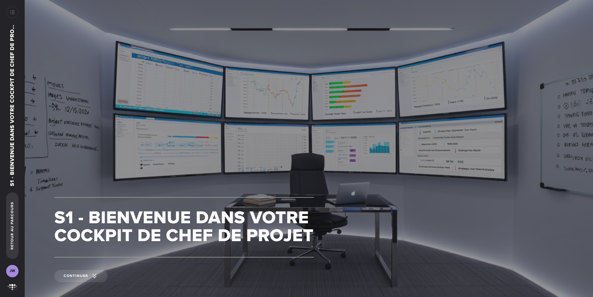

# S1 - Bienvenue dans votre cockpit de chef de projet

**Type :** E-learning
**Durée :** ~30 min
**Statut :** ✅ Complété

## Points clés à retenir

1. **Le cockpit comme métaphore centrale** : Tout comme un pilote surveille ses instruments de vol pour prendre des décisions éclairées, le chef de projet a besoin d'un tableau de bord clair pour piloter son projet numérique.

2. **Trois problèmes classiques du pilotage sans outils** :
   - Réagir au lieu d'anticiper (découvrir les problèmes trop tard)
   - Décider à l'aveugle (sans données fiables)
   - Perdre l'équipe (pas de vision partagée de l'avancement)

3. **Les trois composantes du cockpit** :
   - **La roadmap agile** : savoir où on va et comment s'adapter
   - **Le budget dynamique** : suivre les coûts en temps réel, pas juste en fin de mois
   - **Le dashboard de pilotage** : mesurer ce qui compte vraiment pour les décisions

4. **Principe de "voir juste pour décider tôt"** : L'objectif n'est pas d'avoir un reporting parfait en fin de projet, mais d'avoir une visibilité suffisante pour corriger la trajectoire à temps.
