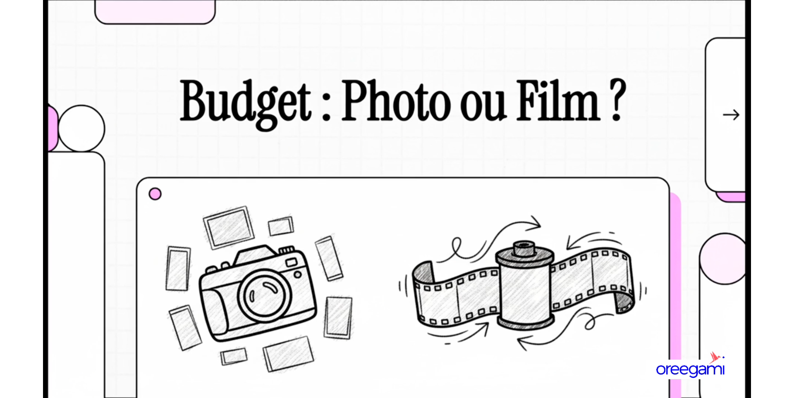
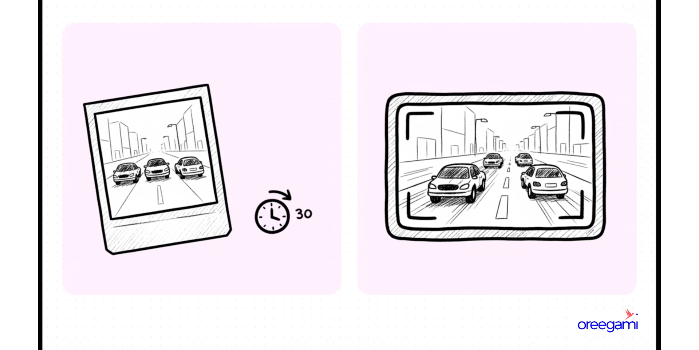
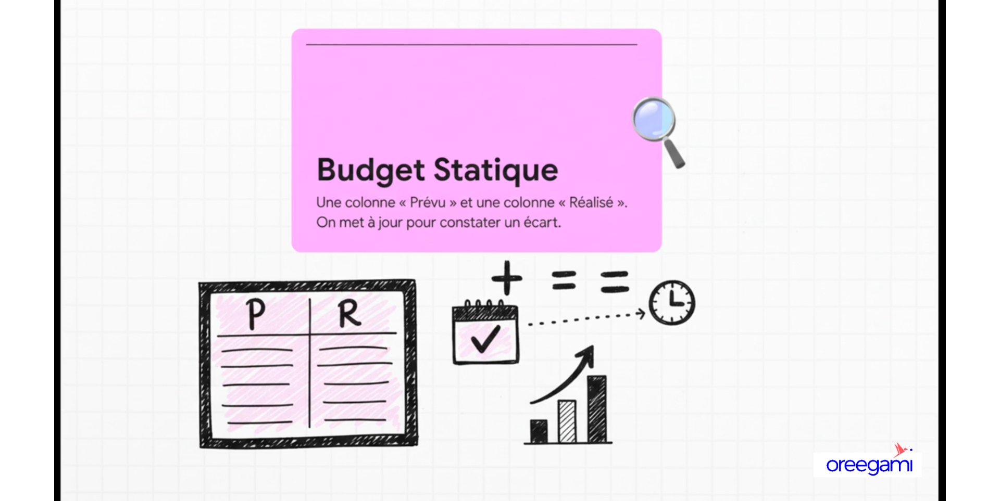
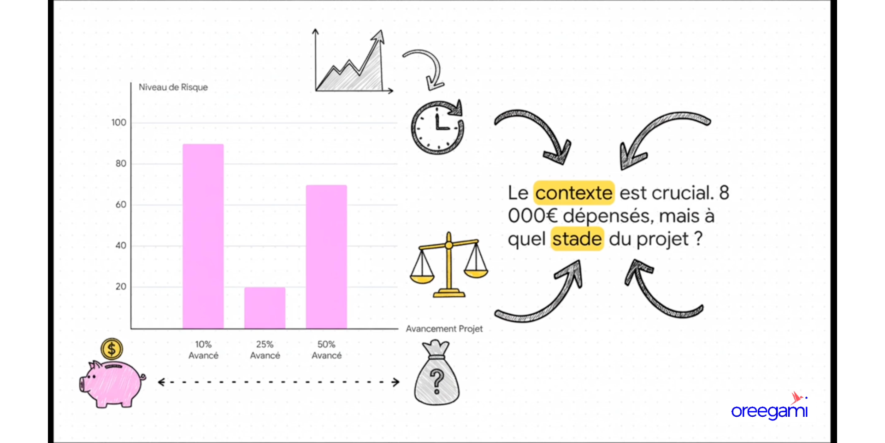
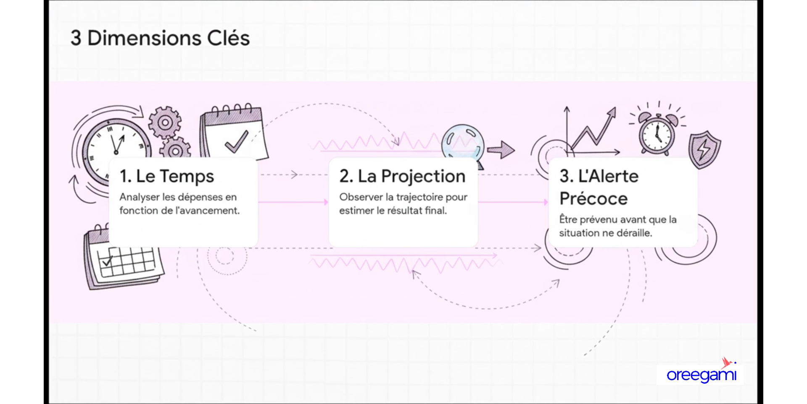

# Budget dynamique : La différence entre une photo et un film

**Type :** Vidéo (Oreegami animé)
**Durée :** ~6 min (341s)
**Statut :** ✅ Complété

## Résumé

Vidéo animée expliquant la différence fondamentale entre un budget statique et un budget dynamique, via la métaphore de la photo et du film.

## Concept central : Photo vs Film

| Budget "Photo" | Budget "Film" |
|----------------|---------------|
| Instantané figé | Évolution continue |
| Établi une fois | Mis à jour régulièrement |
| Montre où on était | Montre où on va |
| Réagit à posteriori | Anticipe et prédit |

## Pourquoi le contexte est crucial

Le même budget peut être rassurant ou alarmant selon l'avancement du projet. 8 000€ dépensés à 10% d'avancement n'a pas la même signification qu'à 50% d'avancement — c'est le concept du **burn rate** contextualisé.

**La question clé :** "À ce rythme de dépense, est-ce qu'on arrivera à la fin du projet dans les limites du budget ?"

## Points à retenir

- Un budget dynamique se lit en tendances, pas en valeurs absolues
- Il faut toujours croiser les dépenses avec le pourcentage d'avancement du projet
- La courbe de dépense doit être cohérente avec la courbe de livraison de valeur

## Transcript (sous-titres auto-générés)

*Gérer un budget, c'est souvent un jonglage permanent entre ce qui a été fait et ce qui reste à faire. Mais ici, on change complètement de perspective. Si, au lieu de voir ça comme une simple photo, on le voyait comme un film en continu — vous allez voir cette petite nuance. Elle change absolument tout.*

*Pour que ce soit bien clair, imaginez une situation toute simple mais où l'enjeu est assez élevé. On doit traverser une grande avenue très fréquentée. On a deux outils : le premier, une photo qui date d'il y a 30 secondes ; le deuxième, une caméra en direct. Lequel on choisit ? On prend la caméra, bien sûr. C'est exactement la même différence entre un budget statique et un budget dynamique.*

*Le budget statique, c'est le grand classique. Un plan fixe avec deux colonnes : ce qu'on a prévu, ce qu'on a réalisé. Son problème fondamental : il ne regarde que dans le rétroviseur. Il dit seulement "où est-ce que j'en étais ?" mais jamais "où suis-je en train d'aller ?" Prenons un exemple : budget total de 25 000€, on a dépensé 8 000€. C'est bien ou pas ? Impossible à dire sans le contexte. Si le projet est avancé à 10 %, c'est une catastrophe. À 25 %, on est pile dans les clous. À 50 %, on est en sous-consommation — ce qui peut aussi cacher un problème.*

*Le budget dynamique, lui, intègre trois dimensions : d'abord le temps (est-ce que cet argent a été dépensé au bon rythme ?) ; ensuite la projection (si je continue sur cette lancée, où est-ce que je vais atterrir ?) ; enfin l'alerte précoce (comme la jauge d'essence qui s'allume quand il reste 80 km d'autonomie, pas quand le moteur s'arrête).*

*Passer au budget dynamique, c'est passer du statut d'observateur passif à celui de pilote aux commandes. L'esprit statique regarde le passé : "Combien on a dépensé ?" L'esprit dynamique est dans l'action : "Est-ce que mes dépenses sont cohérentes avec mon avancement ? Faut-il réagir maintenant ?"*

*Gérer un projet avec un budget statique, c'est aussi dangereux que traverser une rue bondée en se fiant à une photo de 30 secondes. Le film montre ce qui se passe maintenant, ce qui va probablement arriver ensuite, et donne le pouvoir d'agir au bon moment. Le choix est clair : il faut le film, pas la photo.*
