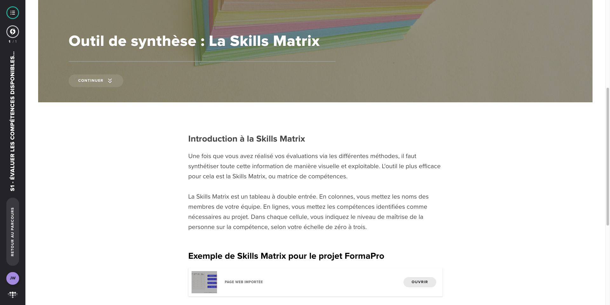

# S1 - Évaluer les compétences disponibles en interne

**Type :** E-learning
**Durée :** ~45 min
**Statut :** ✅ Complété

## Points clés à retenir

1. **La matrice des compétences** : Outil central de cette leçon. Tableau croisé où les lignes sont les personnes de l'équipe et les colonnes sont les compétences identifiées. Permet de visualiser en un coup d'œil qui sait quoi.

2. **Niveaux de maîtrise (échelle typique)** :
   - **0** : Ne connaît pas / pas exposé
   - **1** : Notions (a entendu parler, peut suivre avec aide)
   - **2** : Opérationnel (peut réaliser avec supervision)
   - **3** : Autonome (peut réaliser seul)
   - **4** : Expert (peut former les autres)

3. **Les biais cognitifs à éviter lors de l'évaluation** — tous VRAIS :
   - **Effet Dunning-Kruger** : les moins compétents surestiment leur niveau
   - **Effet Pygmalion** : les attentes du manager influencent les résultats
   - **Biais de confirmation** : on évalue selon ce qu'on a envie de voir
   - **Biais d'ancrage** : la première impression sur quelqu'un colore toutes les évaluations suivantes
   - **Biais de similarité** : on évalue mieux ceux qui nous ressemblent

4. **Méthode recommandée : l'auto-évaluation + validation managériale** : Laisser chaque personne s'auto-évaluer en premier, puis confronter avec l'évaluation du manager pour identifier les écarts de perception.

5. **Cas fil rouge** : Application de la matrice sur une équipe projet type — identification des forces collectives et des lacunes à combler.

