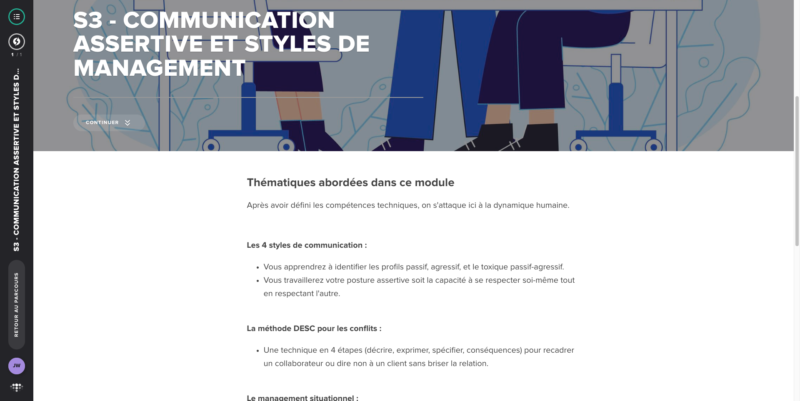

# S3 - Communication assertive et styles de management

**Type :** E-learning
**Durée :** ~40 min
**Statut :** ✅ Complété

## Points clés à retenir

1. **Les quatre styles de communication** :

| Style | Description | Manifestation |
|-------|-------------|---------------|
| **Assertif** | S'exprime clairement, respecte les autres | "Je pense que X parce que Y" |
| **Passif** | Évite le conflit, ne dit pas ce qu'il pense | Se tait, subit, puis explose |
| **Agressif** | Impose ses vues sans considération | Coupe la parole, critique, presse |
| **Passif-agressif** | Dit oui mais agit différemment | Accepte en réunion, n'exécute pas ensuite |

2. **Reconnaître le style passif-agressif** : La personne dit "oui" en face mais ne suit pas dans les actes. C'est le style le plus difficile à gérer car il génère une dissonance entre les paroles et les comportements.

3. **L'assertivité comme compétence centrale du leadership** : Le manager assertif dit ce qu'il pense clairement, défend ses positions avec des arguments, et reste ouvert à la contre-argumentation. Il ne cherche ni à imposer ni à éviter.

4. **Méthode DESC pour une communication assertive** :
   - **D**écrire les faits (sans jugement)
   - **E**xprimer ses émotions
   - **S**pécifier ce qu'on souhaite
   - **C**onséquences positives si la demande est entendue

5. **Adapter son style selon la situation** :
   - Urgence/crise → plus directif
   - Innovation/créativité → plus participatif
   - Formation → plus explicatif
   - Routine mature → plus délégatif

6. **Le feedback comme outil assertif** : Donner du feedback factuel, spécifique et orienté comportement (pas sur la personne) est la pratique fondamentale du manager assertif.
