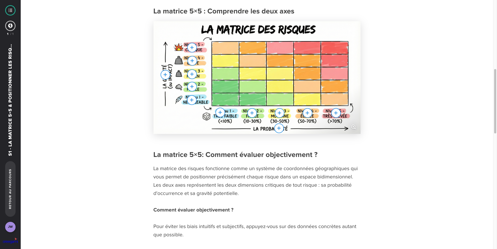

# S1 - La matrice 5×5 & Positionner les risques

**Type :** E-learning
**Durée :** ~40 min
**Statut :** ✅ Complété

## Points clés à retenir

1. **La matrice 5×5 (ou matrice probabilité/gravité)** : Outil standard de priorisation des risques. Chaque risque est évalué sur deux dimensions :
   - **Probabilité** : quelle est la chance que ce risque se réalise ? (1 = très improbable, 5 = quasi-certain)
   - **Gravité** : si le risque se réalise, quel est l'impact sur le projet ? (1 = négligeable, 5 = critique)

2. **Calculer l'indice de criticité** : **Probabilité × Gravité** = indice de criticité (de 1 à 25)
   - Cette multiplication est la méthode correcte — pas la somme, pas la moyenne

3. **Zones de la matrice** :
   - **Zone rouge** (indice > 15) : risques critiques, à traiter en priorité absolue
   - **Zone orange** (indice 8-15) : risques importants, à surveiller et préparer
   - **Zone verte** (indice < 8) : risques acceptables, à documenter et monitorer

4. **Positionner un risque sur la matrice** :
   - Réunir l'équipe pour évaluer collectivement (éviter l'évaluation solitaire qui biaise)
   - S'appuyer sur des données historiques quand disponibles
   - Distinguer la probabilité AVANT et APRÈS les mesures d'atténuation

5. **La matrice est un outil de priorisation, pas de prédiction** : Elle aide à décider où concentrer l'énergie de prévention, pas à prédire l'avenir avec certitude.

6. **Mettre à jour régulièrement** : La position d'un risque sur la matrice change au cours du projet. Un risque qui était orange peut devenir rouge si les conditions changent.
