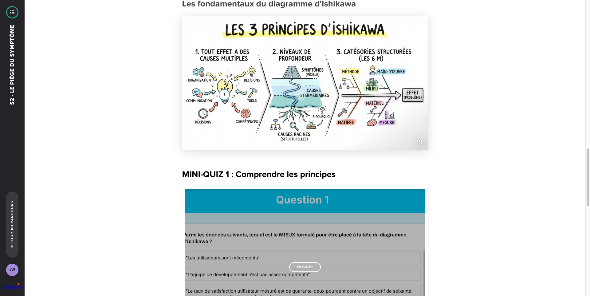
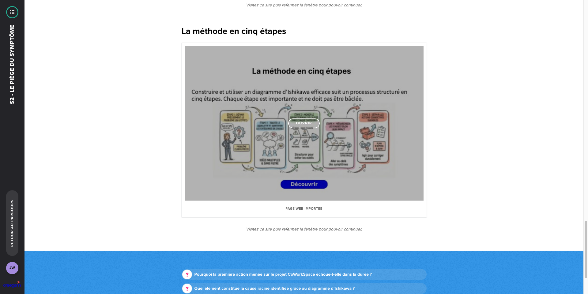

# S2 - Le piège du symptôme

**Type :** E-learning
**Durée :** ~30 min
**Statut :** ✅ Complété

## Points clés à retenir

1. **Le symptôme vs la cause racine** : Un problème visible est souvent le symptôme d'une cause plus profonde. Traiter le symptôme donne l'illusion de résoudre le problème, mais celui-ci revient sous une autre forme.

2. **Exemple classique** : L'équipe livre en retard → on rajoute des ressources → l'équipe continue à livrer en retard. Cause racine probable : les spécifications sont floues au démarrage de chaque sprint, ce qui génère des allers-retours.

3. **La méthode des "5 Pourquoi"** : Outil simple pour remonter à la cause racine. On pose "pourquoi ?" 5 fois de suite jusqu'à identifier la cause fondamentale :
   - Le bug est en production → pourquoi ? Pas de tests → pourquoi ? Pas de temps → pourquoi ? Les sprints sont trop courts → pourquoi ? Les estimations sont irréalistes → **cause racine : processus d'estimation défaillant**

4. **Ne pas chercher le coupable, chercher le système** : La plupart des problèmes dans les projets sont des problèmes systémiques (mauvais processus, mauvaise organisation) et non des problèmes individuels.

5. **Attention aux causes racines multiples** : Parfois un symptôme a plusieurs causes. Ne pas s'arrêter au premier "pourquoi" satisfaisant.

6. **Le diagramme d'Ishikawa (arête de poisson)** : Outil complémentaire pour visualiser toutes les causes potentielles d'un problème, organisées par catégories (méthode, matériel, main-d'œuvre, milieu, mesure, management).

