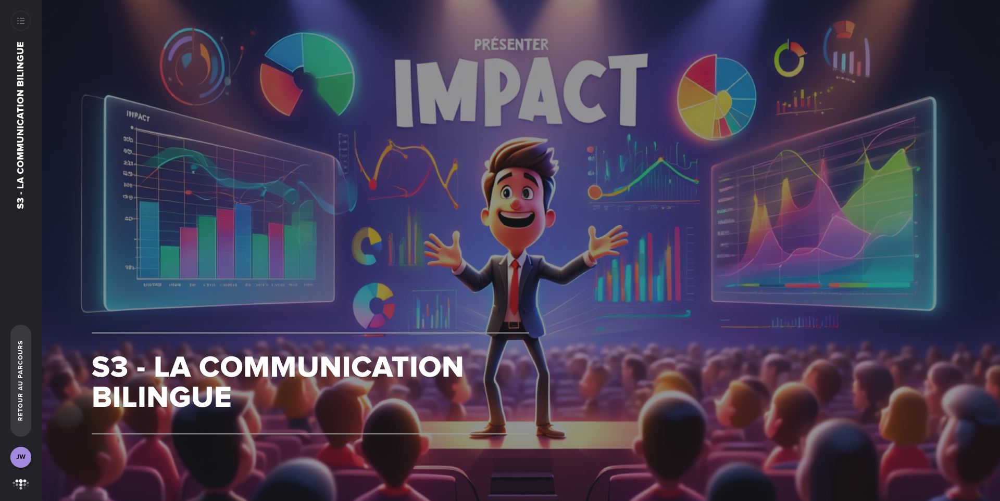

# S3 - La communication bilingue

**Type :** E-learning
**Durée :** ~35 min
**Statut :** ✅ Complété

## Points clés à retenir

1. **"Bilingue" = parler technique ET business** : Le chef de projet no-code doit savoir communiquer avec deux audiences radicalement différentes :
   - L'équipe technique (développeurs no-code, data analysts) : veut comprendre le "comment"
   - La direction/les clients (DG, DAF, directeurs) : veut comprendre le "pourquoi" et l'"impact"

2. **Traduire la technique en business** :
   - ❌ "On a automatisé le workflow Make.com avec 47 modules et 12 webhooks"
   - ✅ "On a supprimé 3h de saisie manuelle par semaine, soit 150h/an économisées"

3. **Le principe de la pyramide inversée (Minto)** :
   - Commencer par la conclusion/recommandation
   - Puis les arguments clés
   - Puis les détails (si demandés)
   - Adapté aux décideurs qui ont peu de temps et veulent l'essentiel en premier

4. **Adapter le vocabulaire à l'audience** :
   - Avec la direction : ROI, risque business, délai de retour sur investissement
   - Avec l'équipe tech : fonctionnalités, API, intégrations, dette technique
   - Avec les utilisateurs finaux : bénéfices concrets, facilité d'utilisation, gain de temps

5. **Data storytelling** : Transformer des données en récit. Les données seules ne convainquent pas — c'est la narration autour des données qui crée l'adhésion.
   - Contexte → Tension → Résolution
   - "Avant notre solution X → Problème Y était présent → Après notre solution, Y est résolu, ce qui se traduit par Z€ économisés"

6. **Visualisation des données** : Le choix du bon graphique est une décision de communication :
   - Évolution dans le temps → courbe
   - Comparaison entre catégories → barres
   - Part d'un tout → camembert (avec parcimonie)
   - Corrélation → nuage de points
