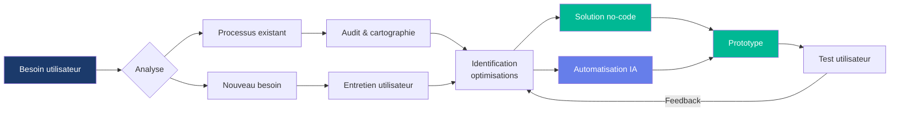
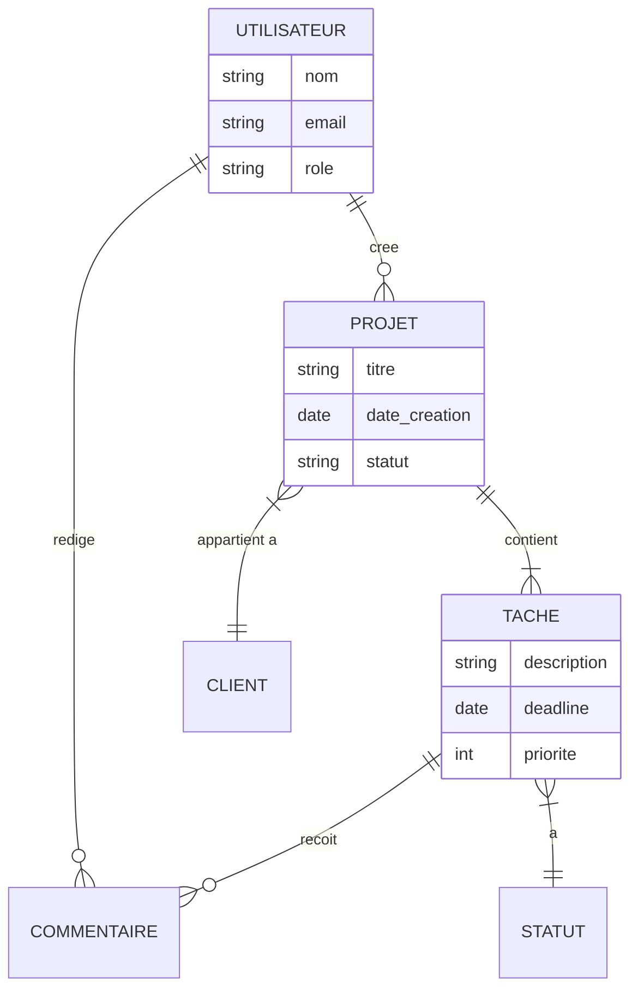

# Génération de diagrammes pour le Passeport

## Quand utiliser

Appelé par Orion quand il rédige les slides qui nécessitent un diagramme :
- **Parcours** : Radar C1-C31 (géré automatiquement par generate.py)
- **C3** : Workflow utilisateur (flowchart Mermaid)
- **C17** : Architecture données / ERD (erDiagram Mermaid)

L'apprenant peut aussi demander un diagramme pour n'importe quelle autre compétence.

## Outil : Mermaid via npx

Aucune installation globale requise. npx télécharge et exécute à la volée.

```bash
npx -y @mermaid-js/mermaid-cli -i input.mmd -o output.svg -t neutral --backgroundColor transparent
```

## Format de sortie

**SVG, fond transparent, thème neutral.** Le SVG sera intégré directement dans le HTML du passeport. Il doit bien rendre sur les slides paysage (297mm x 210mm de contenu utile).

## Comment écrire les diagrammes

### Règles de style communes

- **Thème** : toujours `neutral` (s'intègre avec la palette du passeport)
- **Pas de texte trop long** dans les nœuds : 3-5 mots max par boîte
- **Orientation** : `LR` (gauche à droite) pour les workflows, `TB` (haut en bas) si plus de 4 niveaux
- **Couleurs** : utiliser les classes CSS ou `style` pour appliquer la palette du passeport :
  - Primary : `#1B3A6B`
  - Accent : `#00B894`
  - Light : `#667eea`
  - Muted : `#F8F9FA`

### C3 — Workflow utilisateur

Un flowchart qui montre le parcours utilisateur avec les points d'optimisation no-code/IA.



**Adapter à l'apprenant :** Remplacer les nœuds génériques par les vrais processus de son projet. Le jury veut voir SON workflow, pas un template.

### C17 — Architecture données / ERD

Un diagramme entité-relation qui montre le modèle de données de l'application no-code.



**Adapter à l'apprenant :** Remplacer par les vraies entités de son projet. Inclure les champs clés. Le jury veut voir qu'il comprend la structure de données, pas un modèle générique.

### Diagrammes optionnels (si l'apprenant veut en ajouter)

- **C8** (roadmap) : `gantt` Mermaid
- **C14** (risques) : `quadrantChart` Mermaid (probabilité x gravité)
- **C15** (Ishikawa) : `flowchart` en arête de poisson
- **C20** (workflows Make) : `flowchart LR` montrant les scénarios d'automatisation

## Intégration dans le passeport

### Dans answers.yaml

Ajouter un champ optionnel `diagram_mermaid` dans les compétences qui ont un diagramme :

```yaml
competences:
  C3:
    titre: "Matérialiser les workflows utilisateurs"
    exemple: "..."
    outils: "Miro, Lucidchart"
    reflexion: "..."
    diagram_mermaid: |
      flowchart LR
          A[Demande client] --> B{Type}
          B -->|Simple| C[Traitement auto]
          B -->|Complexe| D[Analyse manuelle]
          ...
```

### Dans le pipeline

1. Avant le rendu Jinja2, pour chaque compétence avec `diagram_mermaid` :
   - Écrire le `.mmd` dans un fichier temporaire
   - Lancer `npx -y @mermaid-js/mermaid-cli -i tmp.mmd -o tmp.svg -t neutral --backgroundColor transparent`
   - Lire le SVG résultant
   - L'injecter dans le contexte Jinja2
2. Le template affiche le SVG dans un conteneur `<div class="diagram-container">` entre le titre et les champs texte

## Rendu paysage

Les diagrammes doivent occuper **max 60% de la largeur de la slide** pour laisser de la place au texte. Sur une slide paysage A4 (297mm utile - 50mm marges = 247mm), ça donne ~150mm max pour le diagramme.

Le SVG est rendu avec `max-width: 150mm; height: auto;` et centré horizontalement.
